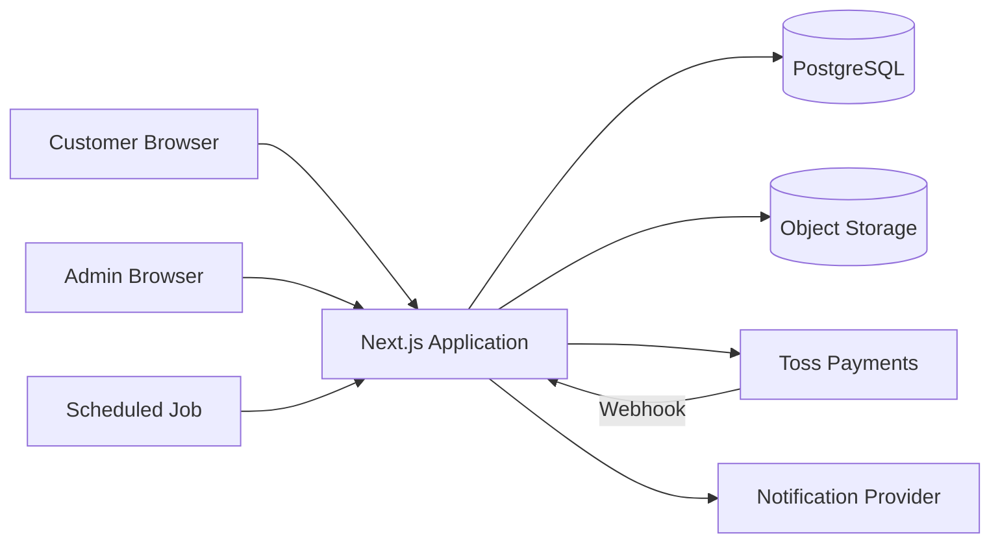
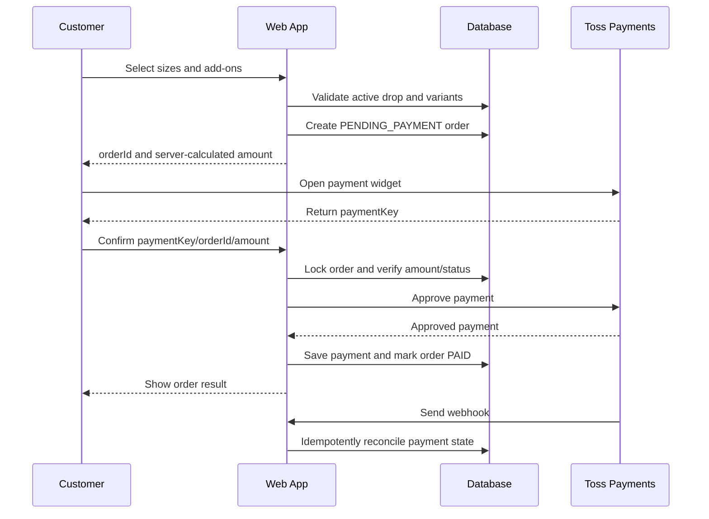

# Kids Drop Shop Application Architecture

## 1. Architecture Goal

키즈 드롭샵의 첫 버전은 다음 흐름을 안정적으로 처리하는 데 집중한다.

```text
이번 주 드롭 공개
-> 옵션 선택
-> 게스트 주문
-> 결제
-> 참여 수량/리워드 갱신
-> 드롭 마감
-> 도매 발주
-> 검수/배송
-> 주문 조회
```

초기에는 플랫폼, 모바일 앱, 다중 판매자 구조를 만들지 않는다. 고객 사이트와 관리자 사이트를 하나의 코드베이스에서 운영하는 모듈형 모놀리스로 시작한다.

## 2. MVP Product Boundary

### Included

- 동시에 활성화되는 드롭 1개
- 메인 상하의 세트 1개
- 상의/하의 사이즈 선택
- 양말, 모자, 헤어핀, 선물포장 같은 추가 옵션
- 7일 프리오더 카운트다운
- 결제 완료 주문 수량 공개
- 참여 수량별 커뮤니티 리워드
- 비회원 주문/결제
- 주문번호 기반 주문 조회
- 지난 드롭 아카이브
- 재오픈 알림 신청
- 관리자용 드롭/상품/주문/배송 관리

### Excluded

- 일반 상품 카탈로그와 검색
- 장바구니에 여러 드롭 담기
- 고객 회원가입과 포인트
- 리뷰/커뮤니티
- 추천 AI
- 공급자/입점사 계정
- 자동 도매 발주
- 복잡한 할인/쿠폰 조합
- 네이티브 모바일 앱

## 3. Technology Decisions

| Area | Choice | Reason |
|---|---|---|
| Web | Next.js App Router + TypeScript | 고객 페이지, 관리자, API를 한 코드베이스로 운영 |
| UI | Tailwind CSS + Radix 기반 컴포넌트 + Lucide icons | 작은 팀에서 빠르게 일관된 UI 구성 |
| Database | PostgreSQL on Supabase | 주문 트랜잭션, 집계, 관리 도구 확보 |
| ORM | Drizzle ORM | SQL 구조를 명시적으로 유지하고 타입 안전성 확보 |
| Validation | Zod | 폼/API 입력과 도메인 입력 검증 통일 |
| Admin Auth | Supabase Auth | 관리자만 로그인, 고객은 게스트 주문 |
| Images | Supabase Storage | 드롭 사진과 아카이브 이미지 저장 |
| Payment | Toss Payments Payment Widget | 국내 카드/간편결제와 결제 승인/취소 처리 |
| Deployment | Vercel | Next.js 배포, 프리뷰, 스케줄 작업 |
| Monitoring | Sentry + structured logs | 결제/주문 오류 추적 |
| Test | Vitest + Playwright | 도메인 규칙과 실제 구매 흐름 검증 |

버전은 프로젝트 스캐폴딩 시점의 안정 버전을 고정한다.

Official references:

- Next.js App Router: https://nextjs.org/docs/app
- Toss Payments integration: https://docs.tosspayments.com/guides/v2/payment-widget/integration
- Toss Payments webhook: https://docs.tosspayments.com/guides/v2/webhook
- Toss Payments webhook events: https://docs.tosspayments.com/reference/using-api/webhook-events
- Supabase Database: https://supabase.com/docs/guides/database/overview
- Supabase Storage: https://supabase.com/docs/guides/storage
- Vercel Cron: https://vercel.com/docs/cron-jobs

## 4. System Context



Next.js 서버만 데이터베이스와 결제 비밀키에 접근한다. 고객 브라우저에서 데이터베이스를 직접 호출하지 않는다.

## 5. Application Modules

```text
Drop
  드롭 공개 기간, 상태, 카운트다운, 아카이브

Catalog
  세트 상품, 사이즈 옵션, 추가 상품, 원가/판매가

Checkout
  선택 옵션 검증, 가격 계산, 주문 초안 생성

Payment
  Toss 결제 승인, 웹훅, 취소, 중복 처리

Order
  주문 상태, 개인정보 스냅샷, 주문 조회

Reward
  결제 완료 수량 집계, 단계별 혜택, 마감 시 최종 확정

Fulfillment
  도매 발주용 수량 집계, 검수, 송장, 배송 상태

Subscriber
  다음 드롭/재오픈 알림 동의와 발송 기록

Admin
  운영자 인증, 드롭 편집, 주문/배송 관리, 감사 로그
```

모듈끼리는 데이터베이스 테이블을 임의로 수정하지 않고 각 모듈의 서비스 함수를 통해 상태를 변경한다.

## 6. Public Routes

```text
/                       현재 드롭
/drops/[slug]           특정 드롭 상세/아카이브
/archive                지난 드롭 목록
/checkout/[dropId]      주문서
/payment/success        결제 승인 처리 결과
/payment/fail           결제 실패 안내
/orders/[publicToken]   주문 조회
/policies/*             이용약관, 개인정보, 배송/교환/환불
```

## 7. Admin Routes

```text
/admin
/admin/drops
/admin/drops/[id]
/admin/orders
/admin/orders/[id]
/admin/fulfillment
/admin/subscribers
/admin/settings
```

관리자 페이지는 검색 노출을 차단하고 인증 및 역할 검사를 통과한 사용자만 접근한다.

## 8. API Boundary

```text
POST /api/orders
  주문 초안 생성 및 서버 가격 재계산

POST /api/payments/toss/confirm
  Toss 결제 승인 후 주문을 PAID로 전환

POST /api/webhooks/toss
  결제 상태 변경 수신, 멱등 처리

POST /api/subscribers
  다음 드롭 알림 신청

POST /api/restock-requests
  지난 드롭 재오픈 요청

POST /api/internal/finalize-drops
  마감 드롭의 최종 리워드와 수량 확정

POST /api/internal/process-outbox
  미발송 알림 처리
```

관리자 변경은 가능한 한 Server Action을 사용하되, 외부 시스템이 호출하는 결제/스케줄 작업은 Route Handler로 분리한다.

## 9. Drop State Model

```text
DRAFT
-> SCHEDULED
-> OPEN
-> CLOSED
-> ORDERING
-> FULFILLING
-> COMPLETED

Any state -> CANCELLED
```

- `OPEN`: 주문서 진입과 신규 주문 생성 가능
- `CLOSED`: 신규 주문 차단, 기존 결제 진행 건 정리
- `ORDERING`: 도매 발주 수량 확정
- `FULFILLING`: 입고, 검수, 포장, 배송
- `COMPLETED`: 모든 주문 처리 완료

화면에 보이는 공개 상태는 `status`, `opens_at`, `closes_at`을 함께 사용해 계산한다. 마감 버튼이나 스케줄 작업이 늦어져도 `closes_at` 이후에는 신규 주문을 받지 않는다.

## 10. Order State Model

```text
PENDING_PAYMENT
-> PAID
-> SUPPLIER_ORDERED
-> RECEIVED
-> PACKING
-> SHIPPED
-> DELIVERED

PENDING_PAYMENT -> EXPIRED
PAID -> CANCEL_REQUESTED -> CANCELLED
```

주문 상태 변경은 `order_status_history`에도 기록한다. 관리자 화면에서 직접 DB 값을 수정하는 방식은 허용하지 않는다.

부분 취소/환불 금액은 주문 배송 상태와 별개이므로 `payments`와 `payment_cancellations`에서 관리한다.

## 11. Checkout And Payment Flow



### Payment Rules

- 금액은 클라이언트 값이 아니라 서버가 상품/옵션 기준으로 다시 계산한다.
- `orderId`, 결제 승인 키, 웹훅 이벤트 ID에는 unique constraint를 둔다.
- 결제 승인과 주문 상태 변경은 중복 호출되어도 결과가 같아야 한다.
- 승인 API 응답을 받지 못해도 웹훅 또는 상태 조회로 복구할 수 있어야 한다.
- 결제 진행 중 드롭이 마감될 수 있으므로 주문 초안은 짧은 만료시간을 가진다.
- 마감 전 생성된 주문은 만료시간 내 결제 완료를 허용하고, 만료된 주문은 승인하지 않는다.
- Toss 웹훅의 `tosspayments-webhook-transmission-id` 헤더로 중복 전송을 제거한다.
- 결제 상태 웹훅은 수신 데이터만 신뢰해 상태를 바꾸지 않고 Toss 결제 조회 결과와 대조한다.
- 웹훅 요청은 빠르게 기록하고 10초 안에 응답하며, 후속 처리는 재시도 가능한 작업으로 넘긴다.

## 12. Community Reward Rules

참여 수량은 `PAID` 상태 주문의 메인 세트 수량 합계로 계산한다. 결제 취소/환불된 수량은 제외한다.

MVP에서 허용하는 리워드:

- 포장 업그레이드
- 사은품 추가
- 다음 드롭 쿠폰

MVP에서 제외하는 리워드:

- 이미 결제한 금액의 자동 차액 환급
- 최종 수량에 따른 배송비 재계산
- 복수 할인 중첩

금액 환급형 리워드는 회계/환불/부분취소 복잡도가 커지므로 초기에는 사용하지 않는다.

드롭 마감 시 트랜잭션 안에서 다음을 확정한다.

1. 유효한 결제 완료 수량 계산
2. 달성한 최종 리워드 단계 결정
3. 드롭에 최종 수량과 리워드 스냅샷 저장
4. 대상 주문에 리워드 entitlement 생성
5. 발주 집계와 알림 이벤트 생성

## 13. Notifications

알림 공급자를 비즈니스 로직과 분리한다.

```ts
interface NotificationSender {
  sendOrderPaid(message: OrderPaidMessage): Promise<void>;
  sendDropClosing(message: DropClosingMessage): Promise<void>;
  sendShipmentStarted(message: ShipmentMessage): Promise<void>;
}
```

초기에는 한 채널만 연동하고, 카카오 알림톡/SMS/이메일을 교체 가능하게 둔다. 주문 트랜잭션 안에서 외부 API를 직접 호출하지 않고 `outbox_events`에 기록한 뒤 별도 작업이 발송한다.

## 14. Security And Privacy

- 고객 결제정보는 저장하지 않고 PG사가 처리한다.
- 주문자의 이름, 전화번호, 주소는 서버에서만 조회한다.
- 운영 로그에는 전화번호와 주소를 기록하지 않는다.
- 관리자 계정은 MFA를 사용한다.
- 주문 조회 URL에는 추측하기 어려운 public token을 사용한다.
- 주문 조회, 알림 신청, 결제 API에 rate limit을 적용한다.
- 관리자 변경, 환불, 주문 상태 변경은 audit log에 남긴다.
- 서비스 키와 결제 비밀키는 서버 환경변수로만 보관한다.
- 개인정보 보관기간과 파기 작업을 운영 정책에 포함한다.

## 15. Reliability

- 결제 웹훅 멱등 처리
- 데이터베이스 unique constraint로 중복 주문/결제 방지
- 주문/결제 상태 전환에 트랜잭션 사용
- 실패한 알림 재시도
- 만료된 미결제 주문 정리
- 드롭 마감 최종화 작업 재실행 가능
- 매일 주문/결제 불일치 점검 작업 실행

## 16. Observability

필수 지표:

- 드롭 페이지 방문 수
- 옵션 선택률
- 주문서 진입률
- 결제 시작률
- 결제 성공률
- 옵션별 판매량
- 주문당 매출/추정 순마진
- 취소/환불/교환률
- 알림 신청률
- 재구매율

필수 오류 알림:

- 결제 승인 실패 급증
- 결제 완료인데 주문이 PAID가 아닌 건
- 웹훅 반복 실패
- 드롭 마감 작업 실패
- 배송 예정일을 넘긴 주문

## 17. Deployment Environments

```text
local
  개발자 로컬 환경, Toss 테스트키, 로컬/개발 DB

preview
  Pull Request 단위 Vercel Preview, 테스트 결제만 허용

production
  운영 DB/Storage/Toss 실결제
```

개발과 운영의 데이터베이스, 저장소, 결제 키를 완전히 분리한다.

## 18. Repository Layout

```text
.
├── docs/
│   ├── application-architecture.md
│   ├── data-model.md
│   └── adr/
├── src/
│   ├── app/
│   │   ├── (store)/
│   │   ├── admin/
│   │   └── api/
│   ├── modules/
│   │   ├── catalog/
│   │   ├── checkout/
│   │   ├── drop/
│   │   ├── fulfillment/
│   │   ├── order/
│   │   ├── payment/
│   │   ├── reward/
│   │   └── subscriber/
│   ├── db/
│   │   ├── schema/
│   │   ├── migrations/
│   │   └── client.ts
│   ├── components/
│   └── lib/
├── tests/
│   ├── integration/
│   └── e2e/
└── public/
```

처음부터 모노레포로 만들지 않는다. 별도 모바일 앱이나 물류 서비스가 실제로 필요해질 때 분리한다.

## 19. Delivery Phases

### Phase 0: Demand Test

- 실제 결제 없이 현재 드롭 랜딩
- 다음 드롭 알림 신청
- 후보 상품 투표

### Phase 1: Commerce MVP

- 현재 드롭
- 옵션 선택
- Toss 결제
- 비회원 주문 조회
- 관리자 주문/배송 관리
- 아카이브

### Phase 2: Operating Efficiency

- 옵션별 발주 집계
- 송장 일괄 등록
- 카카오/SMS 알림
- 재오픈 요청
- 리워드 자동 확정

### Phase 3: Growth

- 고객 계정/재구매
- 쿠폰
- 상품 선정 점수
- 코호트/마진 대시보드
- 일부 PB 상품 관리
