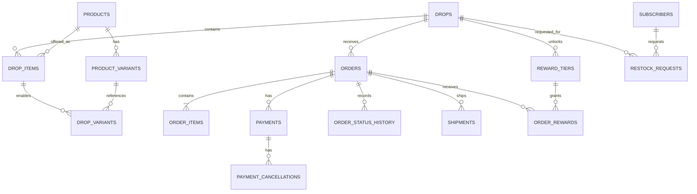

# Kids Drop Shop Initial Data Model

## 1. Principles

- 주문 시점의 상품명, 가격, 옵션, 배송정보를 스냅샷으로 보존한다.
- 결제와 주문 상태는 분리한다.
- 수량 집계는 결제 완료 주문을 기준으로 한다.
- 모든 금액은 원 단위 정수로 저장한다.
- 모든 시간은 데이터베이스에서 UTC로 저장하고 화면에서 Asia/Seoul로 표시한다.
- 개인정보와 운영 데이터를 분리하고 관리자 접근을 제한한다.

## 2. Entity Relationship



## 3. Core Tables

### products

상품의 재사용 가능한 기본 정보.

```text
id uuid pk
name text
slug text unique
product_type enum: SET, ADD_ON, SPECIAL
supplier_name text nullable
supplier_product_code text nullable
description text
safety_notes text nullable
status enum: ACTIVE, INACTIVE
created_at timestamptz
updated_at timestamptz
```

### product_variants

실제 발주 가능한 SKU.

```text
id uuid pk
product_id uuid fk
sku text unique
option_values jsonb
cost_price integer
default_sale_price integer
supplier_stock_status enum: UNKNOWN, AVAILABLE, LIMITED, UNAVAILABLE
is_active boolean
created_at timestamptz
updated_at timestamptz
```

`option_values` 예시:

```json
{
  "part": "top",
  "size": "100",
  "color": "cream"
}
```

### drops

한정 기간 동안 공개되는 판매 단위.

```text
id uuid pk
slug text unique
title text
subtitle text nullable
drop_type enum: WEEKLY_LOOK, SPECIAL
status enum
opens_at timestamptz
closes_at timestamptz
checkout_grace_minutes integer default 10
hero_image_path text
content jsonb
final_paid_quantity integer nullable
final_reward_tier_id uuid nullable
finalized_at timestamptz nullable
created_at timestamptz
updated_at timestamptz
```

운영 정책상 동시에 `OPEN` 가능한 드롭은 1개로 제한한다.

### drop_items

드롭에 포함되는 메인 상품과 추가 상품.

```text
id uuid pk
drop_id uuid fk
product_id uuid fk
role enum: MAIN, ADD_ON, GIFT
display_name text
description text nullable
is_required boolean
min_quantity integer default 0
max_quantity integer default 1
sort_order integer
```

### drop_variants

특정 드롭에서 실제 판매 가능한 옵션과 가격.

```text
id uuid pk
drop_item_id uuid fk
product_variant_id uuid fk
sale_price integer
purchase_limit integer nullable
is_available boolean
```

### reward_tiers

결제 완료 메인 세트 수량에 따른 혜택.

```text
id uuid pk
drop_id uuid fk
threshold_quantity integer
reward_type enum: GIFT, PACKAGING, NEXT_DROP_COUPON
title text
description text
reward_payload jsonb
sort_order integer
```

## 4. Order Tables

### orders

```text
id uuid pk
order_number text unique
public_token text unique
drop_id uuid fk
status enum
currency text default KRW
items_amount integer
shipping_amount integer
discount_amount integer
total_amount integer
buyer_name text
buyer_phone text
buyer_email text nullable
recipient_name text
recipient_phone text
postal_code text
address_line1 text
address_line2 text nullable
delivery_note text nullable
marketing_consent boolean default false
privacy_consent_version text
terms_consent_version text
payment_expires_at timestamptz
paid_at timestamptz nullable
created_at timestamptz
updated_at timestamptz
```

주소/연락처는 화면과 로그에서 마스킹한다.

### order_items

주문 시점의 상품 스냅샷.

```text
id uuid pk
order_id uuid fk
drop_item_id uuid nullable
product_variant_id uuid nullable
sku text
item_name text
option_snapshot jsonb
unit_price integer
quantity integer
line_amount integer
unit_cost_snapshot integer nullable
```

원가 스냅샷은 실제 순마진 분석에 사용한다.

### payments

```text
id uuid pk
order_id uuid fk
provider enum: TOSS
provider_payment_key text unique
provider_order_id text unique
status enum
method text nullable
approved_amount integer
cancelled_amount integer default 0
approved_at timestamptz nullable
raw_summary jsonb
created_at timestamptz
updated_at timestamptz
```

민감한 전체 PG 응답을 그대로 저장하지 않고 운영에 필요한 필드만 보관한다.

### payment_webhook_events

```text
id uuid pk
provider text
provider_transmission_id text unique
event_type text
payload_hash text
status enum: RECEIVED, PROCESSED, FAILED
attempt_count integer default 0
last_error text nullable
received_at timestamptz
processed_at timestamptz nullable
```

Toss Payments의 `tosspayments-webhook-transmission-id` 헤더를 `provider_transmission_id`로 저장한다.

### payment_cancellations

부분 취소와 전체 취소 기록.

```text
id uuid pk
payment_id uuid fk
provider_transaction_key text unique
cancel_amount integer
cancel_reason text
status enum: REQUESTED, DONE, FAILED
requested_by_admin_id uuid nullable
requested_at timestamptz
completed_at timestamptz nullable
raw_summary jsonb nullable
```

### order_status_history

```text
id uuid pk
order_id uuid fk
from_status text nullable
to_status text
reason text nullable
actor_type enum: CUSTOMER, ADMIN, SYSTEM, PAYMENT_PROVIDER
actor_id text nullable
created_at timestamptz
```

### order_rewards

```text
id uuid pk
order_id uuid fk
reward_tier_id uuid fk
status enum: GRANTED, FULFILLED, CANCELLED
reward_snapshot jsonb
created_at timestamptz
fulfilled_at timestamptz nullable
```

### shipments

```text
id uuid pk
order_id uuid fk
carrier_code text nullable
tracking_number text nullable
status enum
shipped_at timestamptz nullable
delivered_at timestamptz nullable
created_at timestamptz
updated_at timestamptz
```

## 5. Marketing And Operations

### subscribers

```text
id uuid pk
phone text nullable
email text nullable
channel enum: SMS, KAKAO, EMAIL
consent_version text
consented_at timestamptz
unsubscribed_at timestamptz nullable
created_at timestamptz
```

전화번호 또는 이메일 중 하나는 필수다.

### restock_requests

```text
id uuid pk
drop_id uuid fk
subscriber_id uuid nullable
phone text nullable
email text nullable
created_at timestamptz
```

동일 드롭/연락처 조합에는 unique constraint를 둔다.

### outbox_events

```text
id uuid pk
event_type text
aggregate_type text
aggregate_id uuid
payload jsonb
status enum: PENDING, PROCESSING, SENT, FAILED
attempt_count integer default 0
available_at timestamptz
last_error text nullable
created_at timestamptz
processed_at timestamptz nullable
```

### audit_logs

```text
id uuid pk
admin_user_id uuid nullable
action text
entity_type text
entity_id uuid nullable
before_data jsonb nullable
after_data jsonb nullable
ip_address inet nullable
created_at timestamptz
```

## 6. Important Constraints

- `drops.slug` unique
- `orders.order_number` unique
- `orders.public_token` unique
- `payments.provider_payment_key` unique
- `payments.provider_order_id` unique
- `payment_webhook_events.provider_transmission_id` unique
- `payment_cancellations.provider_transaction_key` unique
- `product_variants.sku` unique
- 수량, 가격, 금액은 0 이상
- 드롭 종료시간은 시작시간보다 뒤
- 주문 총액은 주문 항목과 배송/할인 합계로 서버에서 검증
- 동일 드롭에서 reward threshold 중복 금지

## 7. Derived Queries

### Current paid quantity

```sql
select coalesce(sum(oi.quantity), 0)
from orders o
join order_items oi on oi.order_id = o.id
join drop_items di on di.id = oi.drop_item_id
where o.drop_id = :drop_id
  and o.status in (
    'PAID',
    'SUPPLIER_ORDERED',
    'RECEIVED',
    'PACKING',
    'SHIPPED',
    'DELIVERED'
  )
  and di.role = 'MAIN';
```

실제 구현에서는 환불 수량과 취소 상태를 반영한다.

### Supplier order summary

```text
drop
-> paid orders
-> order items
-> group by supplier product code and option values
-> export CSV
```

## 8. Later Tables

MVP 검증 전에는 만들지 않는다.

- customer_accounts
- coupons
- reviews
- returns
- exchanges
- supplier_purchase_orders
- inventory_movements
- product_selection_scores
- content_posts
- loyalty_points
